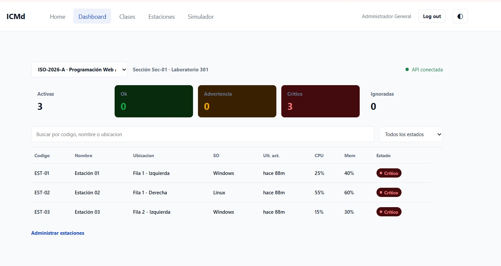
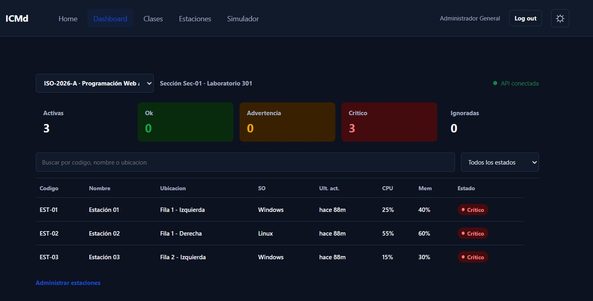
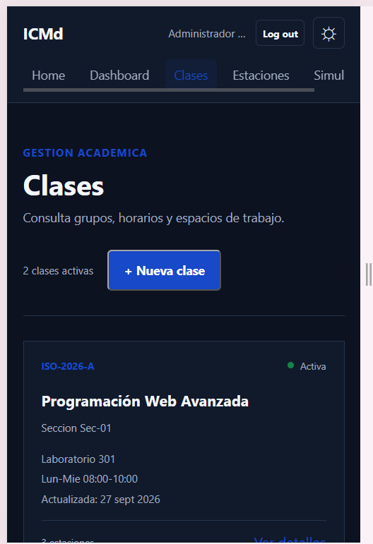
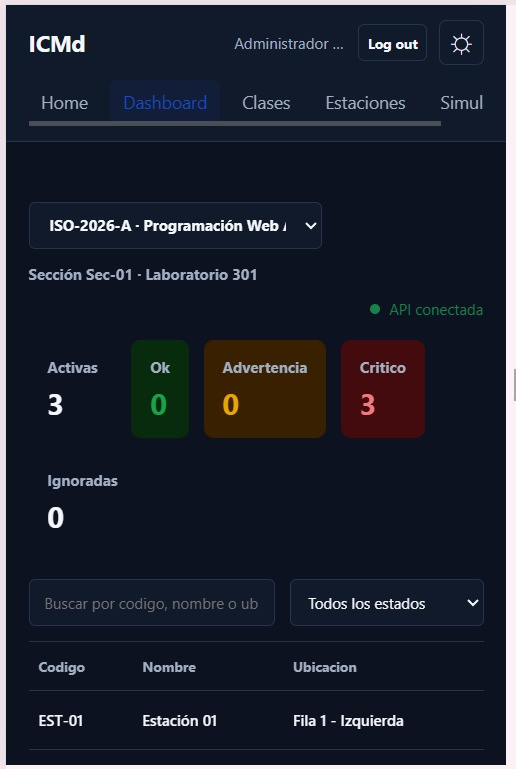

# ICMd v2 — Monitor Web Multiclase de Estaciones

Sistema de monitoreo web en tiempo real para laboratorios académicos y salas de cómputo. Supervisa la disponibilidad, estado de agentes (heartbeat), métricas de hardware (CPU y memoria) y aislamiento de estaciones de trabajo agrupadas por clases y secciones.

Desarrollado por **Alejandro Castellanos**, **Yuilianna Pérez** y **Joana Hernández** · © 2026 ICMd

---

## Capturas de Pantalla

### Vista de Escritorio — Dashboard de Monitoreo



---



### Vista Móvil



---



---

## Requisitos Previos

| Herramienta | Versión mínima | Notas                                                                     |
| ----------- | -------------- | ------------------------------------------------------------------------- |
| **Node.js** | 22.5+          | Probado con v24.x                                                         |
| **npm**     | 10+            | Incluido con Node.js                                                      |
| **SQLite**  | —              | Gestionado automáticamente por Prisma ORM; no requiere instalación manual |

---

## Estructura del Proyecto

```text
ICMd_v2/
├── cliente/                 # Frontend — React 19 + Vite 8 + React Router 7
│   ├── src/
│   │   ├── components/      # Componentes reutilizables (Header, Footer, Modales)
│   │   ├── contexts/        # AuthProvider (sessionStorage) + ThemeProvider
│   │   ├── layout/          # AppContent.jsx — rutas protegidas y públicas
│   │   ├── pages/           # Vistas: Dashboard, Clases, Estaciones, Simulador, Login
│   │   └── services/        # Proveedores de datos (actualmente simulados en memoria)
│   └── vite.config.js
├── servidor/                # Backend — Express 5 + Prisma ORM + SQLite
│   ├── prisma/
│   │   ├── schema.prisma    # Esquema relacional (User, Class, Station, Report)
│   │   ├── migrations/      # Migraciones SQL auto-generadas
│   │   └── seed.js          # Datos iniciales idempotentes
│   ├── src/
│   │   ├── config/          # Conexión DB (db.js) + Swagger (swagger.js / swagger.json)
│   │   ├── controllers/     # Lógica de negocio por recurso
│   │   ├── middleware/      # Autenticación JWT (token.js)
│   │   └── routes/          # Enrutadores Express montados en /api/*
│   ├── tests/               # Pruebas automatizadas (Vitest + Supertest)
│   │   ├── integration/     # Pruebas de integración contra test.db
│   │   ├── helpers.js       # App aislada para Supertest y utilidades
│   │   └── setup.js         # Carga de variables desde .env.test
│   └── vitest.config.js
├── e2e/                     # Pruebas End-to-End con Playwright
├── playwright.config.js     # Configuración E2E (levanta ambos servidores)
├──.env.servidor.example
├──.env.cliente.example
└── README.md
```

---

## Instalación

### 1. Clonar el repositorio

```bash
git clone https://github.com/casteindex/ICMd_v2.git
cd ICMd_v2
```

### 2. Instalar dependencias del servidor

```bash
cd servidor
npm install
```

### 3. Instalar dependencias del cliente

```bash
cd ../cliente
npm install
```

### 4. Instalar dependencias de pruebas E2E (raíz)

```bash
cd ..
npm install
npx playwright install chromium
```

---

## Variables de Entorno

### ICMd_v2 (`servidor/.env`)

Copiar la plantilla y ajustar los valores:

```bash
mv .env.servidor.example servidor/.env
```

Contenido de **`.env.example`** (sin secretos reales):

```ini
# Clave secreta para firmar tokens JWT
JWT_SECRET=cambia_esto_por_una_clave_segura

# Rondas de sal para bcrypt
SALT_ROUNDS=10

# Puerto en el que escucha el servidor Express (por defecto 3000)
PORT=3000
```

| Variable      | Requerida | Descripción                                                         |
| ------------- | --------- | ------------------------------------------------------------------- |
| `JWT_SECRET`  | SI        | Clave para firmar y verificar tokens JWT. Cambiar obligatoriamente. |
| `SALT_ROUNDS` | SI        | Rondas de hash bcrypt para contraseñas (recomendado: `10`).         |
| `PORT`        | NO        | Puerto del servidor Express (por defecto `3000`).                   |

### Cliente (`cliente/.env`)

Copiar la plantilla y ajustar los valores:

```bash
mv .env.cliente.example cliente/.env
```

Contenido de **`.env.example`** (sin secretos reales):

```ini
# Puerto para realizar fetch desde API
VITE_API_URL=http://localhost:3000/api
```

| Variable       | Requerida | Descripción                                  |
| -------------- | --------- | -------------------------------------------- |
| `VITE_API_URL` | SI        | Necesaria para hacer fetch en cada endpoint. |

> [!IMPORTANT]
> Las pruebas **nunca** tocan la base de datos de desarrollo (`dev.db`). Toda la actividad de test ocurre con ayuda del seed.

---

## Migración, Seed y Ejecución

### 1. Aplicar migraciones de base de datos

```bash
cd servidor
npx prisma migrate dev
```

### 2. Cargar datos iniciales (seed)

```bash
node prisma/seed.js
```

### 3. Iniciar la aplicación en desarrollo

Abrir **dos terminales**:

```bash
# Terminal 1 — Servidor API (Puerto 3000)
cd servidor
npm run dev

# Terminal 2 — Cliente Web (Puerto 5173)
cd cliente
npm run dev
```

| Servicio         | URL                                                                                                |
| ---------------- | -------------------------------------------------------------------------------------------------- |
| **Frontend**     | [http://localhost:5173](http://localhost:5173)                                                     |
| **Backend API**  | [http://localhost:3000](http://localhost:3000)                                                     |
| **Swagger UI**   | [http://localhost:3000/swagger-docs](http://localhost:3000/swagger-docs)                           |
| **Swagger JSON** | [http://localhost:3000/swagger-docs/swagger.json](http://localhost:3000/swagger-docs/swagger.json) |

---

## Pruebas

### Pruebas Unitarias y de Integración (Vitest + Supertest)

```bash
cd servidor

# Todas las pruebas (unitarias + integración)
npm test

# Solo pruebas unitarias
npm run test:unit

# Solo pruebas de integración
npm run test:integration
```

### Pruebas End-to-End (Playwright)

Playwright levanta automáticamente el servidor y el cliente:

```bash
# Desde la raíz del proyecto
npm run test:e2e                # Ejecución headless
npm run test:e2e:ui             # Interfaz visual interactiva
npm run test:e2e:headed         # Navegador visible

```

## Credenciales de Demostración

### Opción A — Usar el seed (recomendado)

Después de ejecutar `node prisma/seed.js`:

| Campo          | Valor              |
| -------------- | ------------------ |
| **Email**      | `admin@icmd.local` |
| **Contraseña** | `Admin123!`        |

## Opción B - Usar extensión de VSCODe (REST CLIENT)

En `/servidor` se encuentran un archivo `usuarios.http` que al tener la extensión permite enviar la petición POST para crear el primer usuario al presionar SEND REQUEST.

## Administración Multiclase

### Crear una clase

Las clase se pueden crear desde el Frontend.

### Seleccionar una clase en el Dashboard

En el frontend, el selector `<select>` en la parte superior del Dashboard permite alternar entre clases activas. Al cambiar de clase, se recargan las estaciones y métricas correspondientes exclusivamente a esa clase.

### Operaciones disponibles

| Operación        | Método   | Endpoint           | Notas                                     |
| ---------------- | -------- | ------------------ | ----------------------------------------- |
| Listar clases    | `GET`    | `/api/classes`     | Retorna todas las clases                  |
| Crear clase      | `POST`   | `/api/classes`     | Código único requerido                    |
| Obtener clase    | `GET`    | `/api/classes/:id` | Incluye conteo de estaciones              |
| Actualizar clase | `PUT`    | `/api/classes/:id` | Actualización parcial o total             |
| Eliminar clase   | `DELETE` | `/api/classes/:id` | Restringida si tiene estaciones asignadas |

### Aislamiento entre clases

- Cada estación pertenece a **una sola clase** vía `classId`.
- La restricción `@@unique([classId, code])` permite que el código `PC-01` exista en `WEB-01` y `WEB-02` sin conflictos.
- El endpoint `/api/dashboard/summary?classId=:id` calcula métricas aisladas por clase: `active`, `ok`, `warning`, `critical`, `ignored`.

### Gestión de estaciones dentro de una clase

| Operación           | Método   | Endpoint                    |
| ------------------- | -------- | --------------------------- |
| Listar por clase    | `GET`    | `/api/stations?classId=:id` |
| Crear estación      | `POST`   | `/api/stations`             |
| Detalle estación    | `GET`    | `/api/stations/:id`         |
| Actualizar estación | `PUT`    | `/api/stations/:id`         |
| Ignorar/restaurar   | `PATCH`  | `/api/stations/:id/ignore`  |
| Eliminar estación   | `DELETE` | `/api/stations/:id`         |
| Enviar heartbeat    | `POST`   | `/api/stations/:id/reports` |

---

## Swagger UI — Documentación Interactiva de la API

Disponible con el servidor en ejecución:

🔗 **[http://localhost:3000/swagger-docs](http://localhost:3000/swagger-docs)**

Características:

- Especificación **OpenAPI 3.0.3** completa
- **Try it out** habilitado para probar endpoints en vivo
- **Persistencia de autorización** — el token JWT se conserva entre peticiones
- **Duración de petición** visible para cada llamada

### Grupos de endpoints documentados

| Tag           | Descripción                                               |
| ------------- | --------------------------------------------------------- |
| **Auth**      | Registro del primer admin, login (JWT), listar usuarios   |
| **Classes**   | CRUD completo de clases                                   |
| **Stations**  | CRUD de estaciones, toggle ignored, registro de heartbeat |
| **Dashboard** | Resumen de métricas en tiempo real por clase              |
| **Health**    | Healthcheck del sistema (`GET /api/health`)               |

---

## Decisiones Técnicas

### Stack tecnológico

| Capa                 | Tecnología                | Justificación                                                |
| -------------------- | ------------------------- | ------------------------------------------------------------ |
| **Frontend**         | React 19 + Vite 8         | HMR ultra-rápido, JSX sin transpilación pesada               |
| **Routing**          | React Router DOM 7        | Rutas declarativas con guardias de autenticación             |
| **Backend**          | Express 5                 | Framework minimalista y maduro para APIs REST                |
| **ORM**              | Prisma 7 + better-sqlite3 | Migraciones tipadas, esquema como fuente de verdad           |
| **Base de datos**    | SQLite                    | Sin infraestructura externa, ideal para despliegue académico |
| **Autenticación**    | JWT + bcrypt              | Tokens stateless (1h), hash seguro de contraseñas            |
| **Documentación**    | swagger-ui-express        | Especificación OpenAPI auto-servida e interactiva            |
| **Pruebas servidor** | Vitest + Supertest        | Rápido, compatible con ESM, aislamiento con DB de test       |
| **Pruebas E2E**      | Playwright                | Levanta servidores automáticamente, trazas on-failure        |

### Lógica de estado de heartbeat

La función `calculateStatus()` determina el estado calculado de cada estación:

| Condición                            | Estado calculado |
| ------------------------------------ | ---------------- |
| Sin reportes                         | `SIN_REPORTES`   |
| `ignored === true`                   | `IGNORADA`       |
| `declaredStatus` = `INTERNET` o `IA` | `CRITICO`        |
| `elapsedSeconds` ≤ 25                | `OK`             |
| 26 ≤ `elapsedSeconds` ≤ 40           | `ADVERTENCIA`    |
| `elapsedSeconds` > 40                | `CRITICO`        |

### Modelo de usuario único

El sistema está diseñado para un único administrador. El endpoint `POST /api/auth/register` verifica `user.count()` y bloquea registros posteriores con `403`.

---

## Limitaciones Conocidas

1. **Un solo usuario administrador** — No existe soporte para múltiples roles ni gestión de usuarios adicionales, no se puede crear desde Frontend.

2. **Sesión en `sessionStorage`** — La autenticación del cliente persiste solo durante la pestaña activa (se pierde al cerrar el navegador).

3. **Sin refresh automático** — El Dashboard no implementa polling ni WebSockets; las métricas requieren recarga manual para actualizarse.
